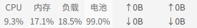

# Linux系统监视悬浮窗
用QML写的系统资源监视悬浮框
* 界面参考 [软媒魔方](http://mofang.ruanmei.com/)  
* 实现参考 [深度系统监视器原理剖析](http://www.jianshu.com/p/deb0ed35c1c2?from=jiantop.com)  
* 实现细节 [Wiki](https://github.com/myml/qml-monitor/wiki)  
* 开发环境 Qt5.9.1
* 发布环境 Qt5.6.1
* 测试环境 Deepin15.4.1 ThinkPad笔记本  
* 截图  
 